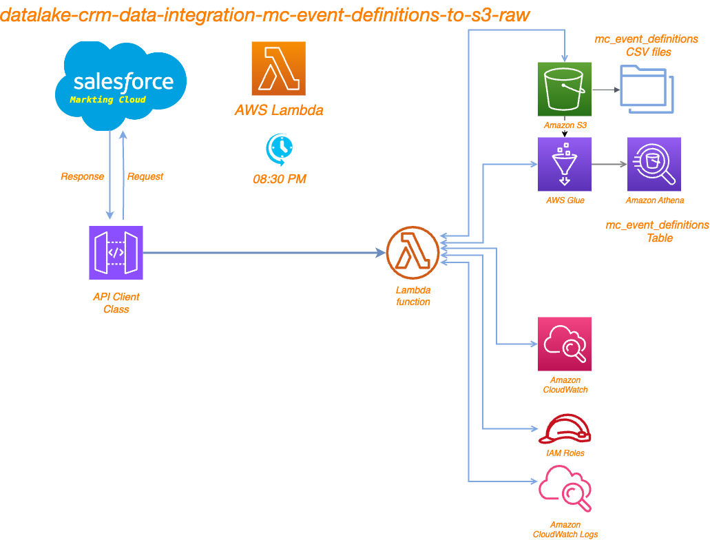

# Project Overview
This project involves extracting data from Salesforce Markting Cloud, processing it, and then storing it in AWS S3. The code is designed to be executed within an AWS Lambda function. The key components of the project include:

	•	Importing necessary libraries and modules
	•	Fetching data from the Salesforce Markting Cloud API
	•	Flattening data with flatten_json
    •   Processing the data into a pandas DataFrame
	•	Saving the processed data to AWS S3 bucket ==> bb2-prod-datalake-raw/mc_event_definitions

# Running

	•	Job scheduled to run every day at 08:30 PM
	•	Fetch data from Salesforce Marketing Cloud API
	•	Process and transform the data into a pandas DataFrame
	•	Store the processed data in an S3 bucket as a Parquet file for further use

# Prerequisites

Before running the code, ensure you have the following prerequisites:

	- Environment Variables: The following environment variables should be set:

	    •	TOKEN_URL: URL for Salesforce Markting Cloud token
	    •	SALESFORCE_AUTH_DETAILS: Authentication details for Salesforce Markting Cloud
	    •	ENV: Environment name (e.g., dev, prod)

# File Structure
    .
    ├── main.py                   # Main script containing the Lambda handler
    ├── api_client.py             # Contains the APIClient class for handling API requests
    ├── custom_functions.py       # Contains custom utility functions
    └── requirements.txt          # List of required Python packages

# Digram

