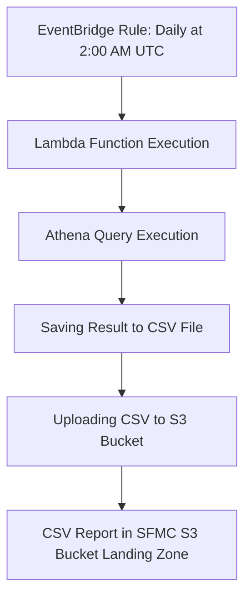

# Customers Affluency data reporting to SFMC system
## Process Flow



## Environment Variables
S3_BUCKET: The name of the S3 bucket where the CSV report will be uploaded.

## Report Highlights
CRM want to be able to identify customers based on these characteristics for targeted marketing purposes
`user_id`, `affluency`, `age_range`

`affluency` logic:
```
CASE
    when Income_GBP_Value IS NULL
    and Assets_GBP_Value IS NULL then NULL
    WHEN Income_GBP_Value >= 100000
    or Assets_GBP_Value >= 200000 then 'Affluent'
    WHEN Income_GBP_Value >= 50000
    or Assets_GBP_Value >= 60000 then 'Mass Affluent'
    WHEN Income_GBP_Value < 50000
    or Assets_GBP_Value < 60000 then 'Mass'
    ELSE NULL
END as Affluency
```
