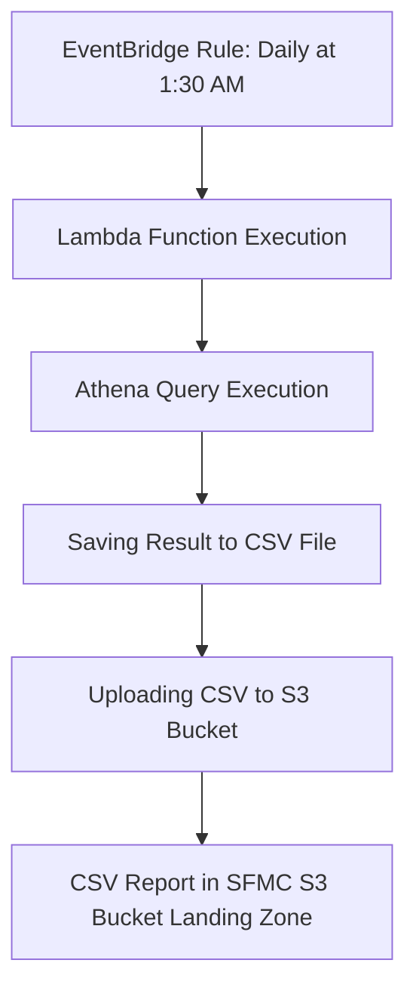

# FTD Accounts fund data reporting to SFMC system
## Process Flow

## Environment Variables
S3_BUCKET: The name of the S3 bucket where the CSV report will be uploaded.

## Report Highlights
    The dataset contains details of Active and Closed FTDs that are 21 days pre and post maturity.
    We decided to include 21 days as this will allow dynamic filtering on Maturity Date to include the data required based on the scope such as 14 days since pre and post maturity of FTDs.

## Data Dictionary

| Column Name                        | Column Description                                                                                                                                                                                                                         |
|------------------------------------|---------------------------------------------------------------------------------------------------------------------------------------------------------------------------------------------------------------------------------------------|
| Customer_ID                        | Unique Customer ID                                                                                                                                                                                                                         |
| Account_Holder_Key                 | Unique Customer Account ID                                                                                                                                                                                                                 |
| FTD_Account_ID                     | Unique FTD Account ID linked to a customer. One FTD Account ID generated for each FTD. One customer can have multiple FTD's.                                                                                                                |
| Affluency                          | Affluent, Mass Affluent or Mass.                                                                                                                                                                                                            |
| Account_Type                       | FIXED DEPOSIT                                                                                                                                                                                                                               |
| Name                               | The full name of the type of Fixed Deposit.                                                                                                                                                                                                 |
| Account_State                      | This shows whether the FTD is Active or Closed.                                                                                                                                                                                             |
| FTD_Term                           | 3-months, 6-months or 12-months.                                                                                                                                                                                                            |
| FTD_Interest_Rate                  | Rate given to customer when FTD was taken out.                                                                                                                                                                                              |
| Currency_Code                      | This can be GBP or EUR or USD.                                                                                                                                                                                                              |
| Interest_Accrued_Amount            | This is the interest accrued on the FTD account up until present day. If the FTD is Closed then this will show the Total Interest Accrued. If the FTD is still Active this will show the amount of interest accrued thus far.                |
| FTD_Open_Date                      | Date the FTD (FTD_Account_ID) was opened.                                                                                                                                                                                                   |
| FTD_Maturity_Date                  | Date the FTD (FTD_Account_ID) Matures.                                                                                                                                                                                                      |
| FTD_Balance_at_Maturity            | This is the Balance of the FTD at maturity in the currency in which the FTD was taken out. This will be the Fixed Term Deposit Amount plus interest accrued over the full term of the FTD. This is only populated for FTDs that have Matured. |
| FTD_Balance_at_Maturity_in_GBP     | This is the Balance of the FTD (converted to GBP) at maturity in the currency in which the FTD was taken out. This will be the Fixed Term Deposit Amount plus interest accrued over the full term of the FTD. This is only populated for FTDs that have Matured. |
| Next_FTD_Account_ID                | This is the FTD Account ID of the FTD the customer took out after the FTD currently being shown - FTD_Account_ID.                                                                                                                            |
| Next_FTD_Approved_Date             | This is the FTD Approved Date of the FTD the customer took out after the FTD currently being shown - FTD_Account_ID.                                                                                                                        |
| FTD_Opened_Within_1_Days_Maturity  | This is an indicator 1 or 0. 1 Means that the customer opened a new FTD within 1 day of maturity of the current FTD being shown.                                                                                                            |
| FTD_Opened_Within_3_Days_Maturity  | This is an indicator 1 or 0. 1 Means that the customer opened a new FTD within 3 days of maturity of the current FTD being shown.                                                                                                            |
| FTD_Opened_Within_7_Days_Maturity  | This is an indicator 1 or 0. 1 Means that the customer opened a new FTD within 7 days of maturity of the current FTD being shown.                                                                                                            |
| FTD_Opened_Within_14_Days_Maturity | This is an indicator 1 or 0. 1 Means that the customer opened a new FTD within 14 days of maturity of the current FTD being shown.                                                                                                           |
| GBP_FTD_Interest_rate              | This is the interest rate of the GBP Fixed Deposit linked to the FTD_Account_ID.                                                                                                                                                            |
| GBP_FTD_First_Inbound_Date         | The date the GBP FTD was approved.                                                                                                                                                                                                          |
| GBP_FTD_First_Inbound_Balance      | The GBP amount deposited into the FTD Account when opening the account.                                                                                                                                                                     |
| GBP_FTD_Last_Inbound_Date          | The last Date the GBP FTD account was updated.                                                                                                                                                                                              |
| GBP_FTD_Total_Balance              | The Total Balance of all Active GBP Fixed Deposit Accounts linked to the customer at present.                                                                                                                                               |
| GBP_FTD_Is_Open                    | This is an indicator of true or false to indicate whether the customer's GBP FTD Account is Open (true) or Closed (false).                                                                                                                 |
| Number_GBP_FTDs                    | This is the Total number of Active GBP Fixed Deposits the customer currently has at present.                                                                                                                                                |
| EUR_FTD_Interest_rate              | This is the interest rate of the Euro Fixed Deposit.                                                                                                                                                                                        |
| EUR_FTD_First_Inbound_Date         | The date the Euro FTD was approved.                                                                                                                                                                                                         |
| EUR_FTD_First_Inbound_Balance      | The Euro amount deposited into the Euro FTD Account when opening the account.                                                                                                                                                               |
| EUR_FTD_Last_Inbound_Date          | The last Date the Euro FTD account was updated.                                                                                                                                                                                             |
| EUR_FTD_Total_Balance_in_GBP       | The Total Balance converted to GBP of all Active Euro Fixed Deposit Accounts linked to the customer at present.                                                                                                                             |
| EUR_FTD_Total_Balance              | The Total Balance in Euro of all Active Euro Fixed Deposit Accounts linked to the customer at present.                                                                                                                                       |
| EUR_FTD_Is_Open                    | This is an indicator of true or false to indicate whether the customer's Euro FTD Account is Open (true) or Closed (false).                                                                                                                |
| Number_EUR_FTDs                    | This is the Total number of Active Euro Fixed Deposits the customer currently has at present.                                                                                                                                               |
| USD_FTD_Interest_rate              | This is the interest rate of the USD Fixed Deposit.                                                                                                                                                                                         |
| USD_FTD_First_Inbound_Date         | The date the USD FTD was approved.                                                                                                                                                                                                          |
| USD_FTD_First_Inbound_Balance      | The USD amount deposited into the USD FTD Account when opening the account.                                                                                                                                                                 |
| USD_FTD_Last_Inbound_Date          | The last Date the USD FTD account was updated.                                                                                                                                                                                              |
| USD_FTD_Total_Balance_in_GBP       | The Total Balance converted to GBP of all Active USD Fixed Deposit Accounts linked to the customer at present.                                                                                                                              |
| USD_FTD_Total_Balance              | The Total Balance in USD of all Active USD Fixed Deposit Accounts linked to the customer at present.                                                                                                                                         |
| USD_FTD_Is_Open                    | This is an indicator of true or false to indicate whether the customer's USD FTD Account is Open (true) or Closed (false).                                                                                                                 |
| Number_USD_FTDs                    | This is the Total number of Active USD Fixed Deposits the customer currently has at present.                                                                                                                                                |
