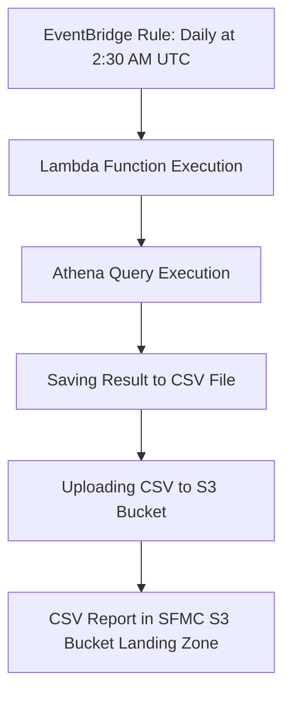

# IAS Accounts data reporting to SFMC system
## Process Flow

```mermaid
graph TD
    A[EventBridge Rule: Daily at 2:30 AM UTC] --> B[Lambda Function Execution]
    B --> C[Athena Query Execution]
    C --> D[Saving Result to CSV File]
    D --> E[Uploading CSV to S3 Bucket]
    E --> F[CSV Report in SFMC S3 Bucket Landing Zone]
```

## Environment Variables
S3_BUCKET: The name of the S3 bucket where the CSV report will be uploaded.
