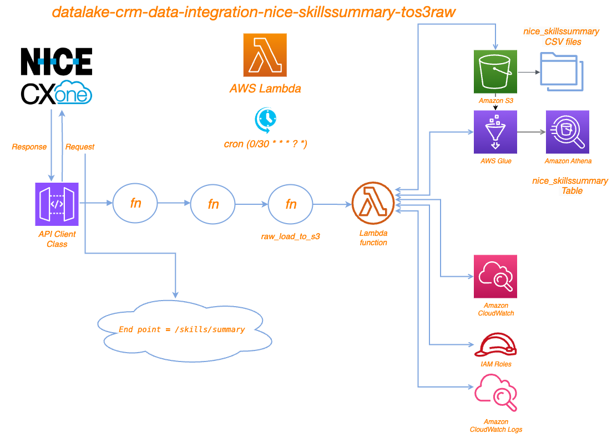

# Project Overview
This project involves extracting data from Nice, processing it, and then storing it in AWS S3. The code is designed to be executed within an AWS Lambda function. The key components of the project include:

	•	Importing necessary libraries and modules
	•	Fetching data from the Nice API
	•	Flattening data with flatten_json
    •   Processing the data into a pandas DataFrame
	•	Saving the processed data to AWS S3 bucket ==> bb2-prod-datalake-raw/Nice_skillssummary

# Running

	•	The cron job for this lambda "cron(0 * * * ? *)"
	•	This Lambda was created to send API request to Nice with this end point:
        - "skills/summary?startDate={startDate}&endDate={endDate}"
	•	The response comning with json data
	•	The json data has been flattened with flatten_json lib and became python data list.
	•	The python data list transformed to data frame with Pandas lib after processing on it.
	•	Using raw_load_to_s3 function to load the csv file to bb2-datalake-raw and creating a table "nice_skillssummary".

## Sample Event
Before triggering the Lambda function, provide a specific event in the following format:
```
{
  "start_date": "2025-06-05 21:00:41.071",
  "end_date": "2025-06-30 23:59:59.999"
}

```

# Prerequisites

Before running the code, ensure you have the following prerequisites:

	- Python Libraries: The necessary Python libraries include os, pandas, flatten_json, datetime, api_client, and custom_functions.

	- Environment Variables: The following environment variables should be set:

	    •	TOKEN_URL: URL for Nice token
	    •	Nice_AUTH_DETAILS: Authentication details for Nice
	    •	ENV: Environment name (e.g., dev, prod)

# File Structure
    .
    ├── main.py                   # Main script containing the Lambda handler
    ├── api_client.py             # Contains the APIClient class for handling API requests
    ├── custom_functions.py       # Contains custom utility functions
    ├── data_catalog.py           # Contains column comments and schemas
    └── requirements.txt          # List of required Python packages


# Digram


