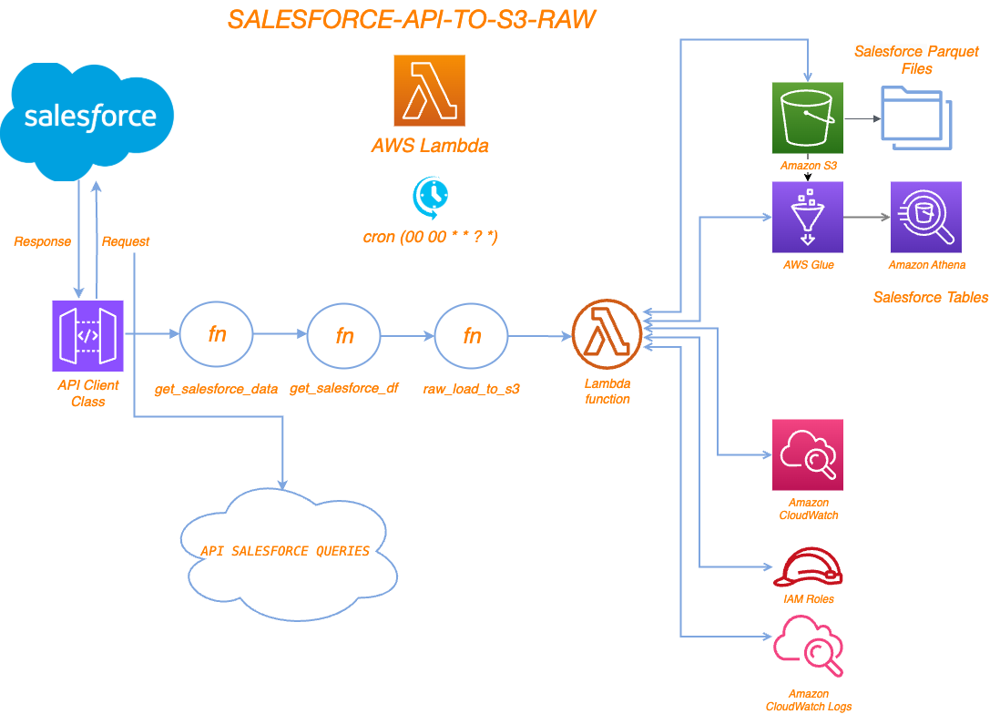

# Salesforce Generic Lambda

# Project Overview
This project involves extracting data from Salesforce, processing it, and then storing it in AWS S3. The code is designed to be executed within an AWS Lambda function. The key components of the project include:

	•	Importing necessary libraries and modules
	•	Fetching data from the Salesforce API
	•	Flattening data with flatten_json
    •   Processing the data into a pandas DataFrame
	•	Saving the processed data to AWS S3 bucket ==> bb2-prod-datalake-raw/salesforce_tables

## Sample Full Event Structure
```
{
 "table_name": "salesforce_accounthistory",
  "cdc_field": "CreatedDate",
  "start_date": "2025-02-18 23:55:30.000",
  "end_date":   "2025-10-20 00:00:00.000",
  "extra_soql_condition": "Field = 'FirstName'"
}
```

## Events To Manually Ingest Tables For backfill Time.
- Modify `start_date` as needed, this way lambda handler will not request athena for SQL Query(`optional`).
- Modify `end_date` as needed, this way lambda handler will add end date(`optional`).
- Modify `extra_soql_condition` as needed, this way lambda handler will additonal SOQL Query(`optional`).
- Below tables are already included in `data_catalog.py`.
```
[
  {
    "table_name": "salesforce_account"
  },
  {
    "table_name": "salesforce_valuation"
  },
  {
    "table_name": "salesforce_casenumber_valuation"
  },
  {
    "table_name": "salesforce_emailmessage"
  },
  {
    "table_name": "salesforce_accounthistory"
  },
  {
    "table_name": "salesforce_cases"
  },
  {
    "table_name": "salesforce_jointmortgages"
  },
  {
    "table_name": "salesforce_casehistory"
  },
  {
    "table_name": "salesforce_feedcomment"
  },
  {
    "table_name": "salesforce_casemilestone"
  },
  {
    "table_name": "salesforce_contact"
  },
   {
    "table_name": "salesforce_propfin"
  },
  {
    "table_name": "salesforce_rework_reason"
  },
  {
    "table_name": "salesforce_survey"
  },
  {
    "table_name": "salesforce_surveytaker"
  },
  {
    "table_name": "salesforce_surveyquestion"
  },
  {
    "table_name": "salesforce_surveyquestionresponse"
  },
  {
    "table_name": "salesforce_user"
  },
  {
    "table_name": "salesforce_milestonetype"
  },
  {
    "table_name": "salesforce_psd_form_c"
  },
  {
    "table_name": "salesforce_psd001_form_c"
  },
  {
    "table_name": "salesforce_applicants"
  },
  {
    "table_name": "salesforce_shareholders"
  },
  {
    "table_name": "salesforce_spv"
  },
]
```
# Digram


