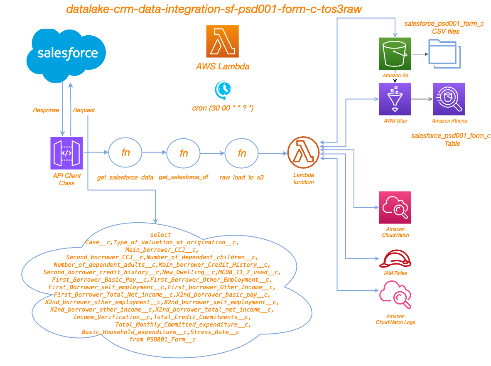

# Project Overview
This project involves extracting data from Salesforce, processing it, and then storing it in AWS S3. The code is designed to be executed within an AWS Lambda function. The key components of the project include:

	•	Importing necessary libraries and modules
	•	Fetching data from the Salesforce API
	•	Flattening data with flatten_json
    •   Processing the data into a pandas DataFrame
	•	Saving the processed data to AWS S3 bucket ==> bb2-prod-datalake-raw/salesforce_psd001_form_c

# Running

	•	The cron job for this lambda "cron(30 00 * * ? *)"
	•	This Lambda was created to send API request to Salesforce with this query:
        - "salesforce_psd001_form_c": "q=select Case__c,Type_of_valuation_at_origination__c,Main_borrower_CCJ__c,Second_borrower_CCJ__c,
            Number_of_dependent_children__c,Number_of_dependent_adults__c,Main_borrower_Credit_History__c,Second_borrower_credit_history__c,New_Dwelling__c,MCOB_11_7_used__c,First_Borrower_Basic_Pay__c,First_Borrower_Other_Employment__c,First_Borrower_self_employment__c,First_borrower_Other_Income__c,First_Borrower_Total_Net_income__c,X2nd_borrower_basic_pay__c,X2nd_borrower_other_employment__c,
            X2nd_borrower_self_employment__c,X2nd_borrower_other_income__c,X2nd_borrower_total_net_income__c,Income_Verification__c,Total_Credit_Commitments__c,Total_Monthly_Committed_expenditure__c,Basic_Household_expenditure__c,Stress_Rate__c from PSD001_Form__c"
	•	The response comning with json data
	•	The json data has been flattened with flatten_json lib and became python data list.
	•	The python data list transformed to data frame with Pandas lib after processing on it.
	•	Using raw_load_to_s3 function to load the csv file to bb2-datalake-raw and creating a table "salesforce_psd001_form_c".

# Prerequisites

Before running the code, ensure you have the following prerequisites:

	- Python Libraries: The necessary Python libraries include os, pandas, flatten_json, datetime, salesforce_queries, api_client, and custom_functions.

	- Environment Variables: The following environment variables should be set:

	    •	TOKEN_URL: URL for Salesforce token
	    •	SALESFORCE_AUTH_DETAILS: Authentication details for Salesforce
	    •	SALESFORCE_API_VERSION: Salesforce API version
	    •	ENV: Environment name (e.g., dev, prod)

# File Structure
    .
    ├── main.py                   # Main script containing the Lambda handler
    ├── api_client.py             # Contains the APIClient class for handling API requests
    ├── custom_functions.py       # Contains custom utility functions
    ├── salesforce_queries.py     # Contains Salesforce query configurations
    ├── data_catalog.py           # Contains column comments and schemas
    └── requirements.txt          # List of required Python packages

# Digram

