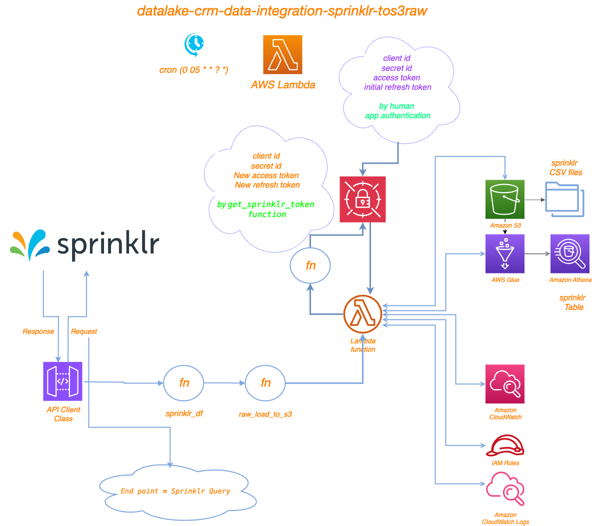

# Project Overview
This project involves extracting data from Sprinklr, processing it, and then storing it in AWS S3. The code is designed to be executed within an AWS Lambda function. The key components of the project include:

	•	Importing necessary libraries and modules
	•	Fetching data from the Sprinklr API
	•	Flattening data with flatten_json
    •   Processing the data into a pandas DataFrame
	•	Saving the processed data to AWS S3 bucket ==> bb2-prod-datalake-raw/sprinklr

# Running

	•	The cron job for this lambda "cron(0 05 * * ? *)"
	•	This Lambda was created to send API request to Sprinklr with this end point:
    •	payload.json is as copied from Sprinklr UI.
	•	The response comning with json data
	•	The json data has been flattened with flatten_json lib and became python data list.
	•	The python data list transformed to data frame with Pandas lib after processing on it.
	•	Using raw_load_to_s3 function to load the csv file to bb2-datalake-raw and creating a table "sprinklr".


# Backfill event sample
Only in case you want to request data for a specific period, pypassing daily CDC logic.
Pass the below:
```
{
	"start_date":"2025-01-01",
	"end_date":"2025-01-07"
}
```

# Prerequisites

Before running the code, ensure you have the following prerequisites:

	- Python Libraries: The necessary Python libraries include os, pandas, flatten_json, datetime, api_client, and custom_functions.

	- Environment Variables: The following environment variables should be set:

	    •	TOKEN_URL: URL for Nice token
	    •	SPRINKLR_AUTH_DETAILS: Authentication details for Sprinklr
		 - The Refresh Token has no expiry time but can be used only once. When you regenerate the token using the refresh token API, a new refresh token will be generated, and the previous one will become invalid.
         - So we update the refresh_token every time Lambda run in the AWS secret manager
	    •	ENV: Environment name (e.g., dev, prod)

# File Structure
    .
    ├── main.py                   # Main script containing the Lambda handler
    ├── api_client.py             # Contains the APIClient class for handling API requests
    ├── custom_functions.py       # Contains custom utility functions
    ├── payload.json              # Contains API payload from Sprinklr UI.
    ├── data_catalog.py           # Contains column comments and schemas
    └── requirements.txt          # List of required Python packages

# How to understand payload
https://dev.sprinklr.com/reporting
https://dev.sprinklr.com/custom-query

# How to generate a access/refresh token pairs
https://developer.sprinklr.com/docs/read/authorize/OAuth_for_Customers

# Digram


